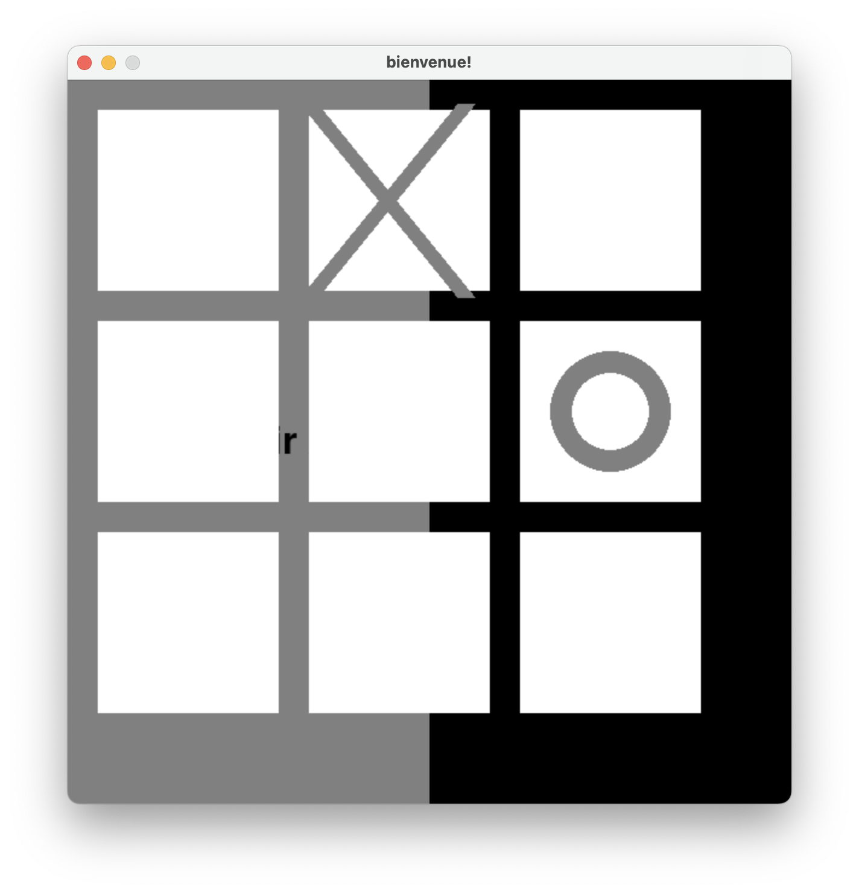

# tictactoe-python

A Game built with Python and its library PyGame

## Rules of the Game

To win, the player needs to align 3 of the same symbol he chose before the computer.
The goal is to be the first player to achieve three of their symbols in a line while preventing the opponent from doing the same. 

